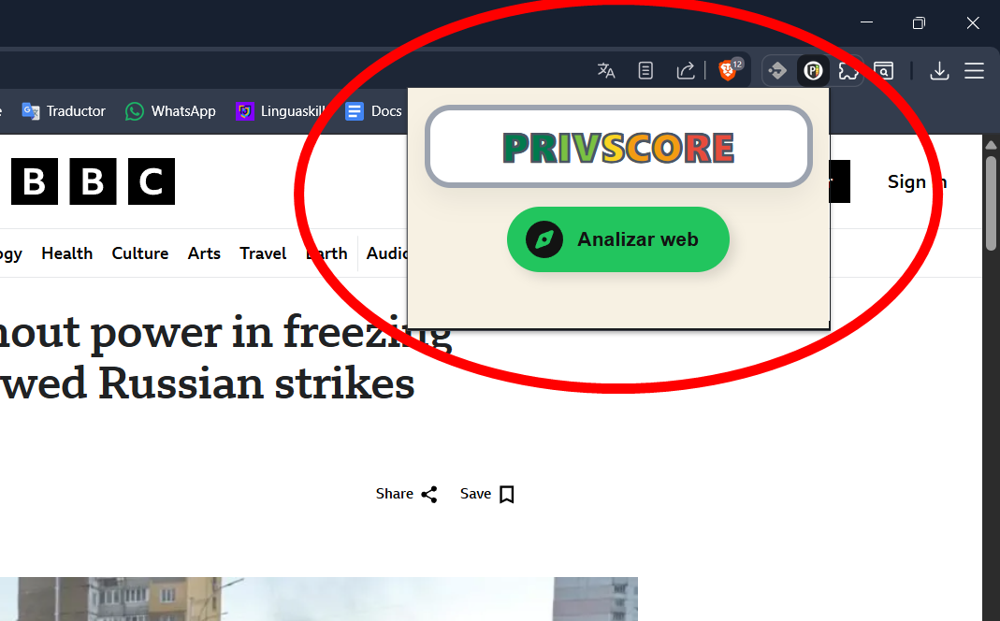
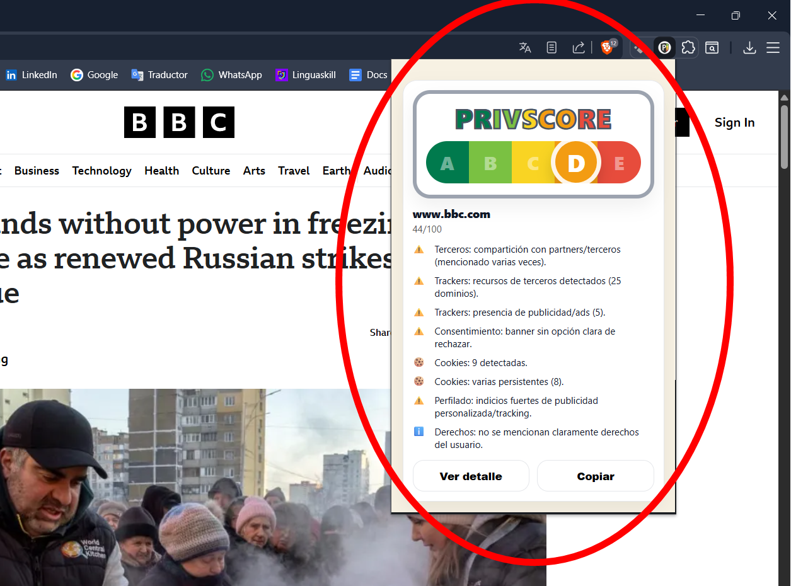

# PrivScore Extension 🛡️

> “NutriScore de privacidad” para webs: una extensión que analiza **cookies**, **señales de tracking** y **políticas de privacidad** para devolver una **nota A–E** con explicación clara.

<p align="center">
  
  
  
  
</p>

---

## 📸 Capturas

<p align="center">
  
</p>

<p align="center">
  
</p>

## ✨ Qué hace

- ✅ Muestra una **nota A–E** (tipo NutriScore) para la web actual.
- 🍪 Analiza **cookies** (total, persistentes, y señales de ads/analytics si se detectan).
- 🌐 Detecta **recursos externos** y **dominios de terceros** (scripts, iframes, preconnect/dns-prefetch, etc.).
- 🧠 (Opcional) Usa **IA (Gemini)** para **extraer señales** del texto legal (la IA **no decide** la nota).
- 📌 Genera un resumen “human-readable” con motivos y señales de riesgo.

> [!NOTE]  
> La **letra final** siempre la calcula un **scoring determinista** (reglas y pesos). La IA, si se activa, solo ayuda a **extraer señales/evidencias**.

---

## 🧩 Cómo funciona (alto nivel)

1. El popup pide analizar la pestaña actual.
2. Se recopilan señales:
   - cookies del dominio
   - links a política de privacidad/cookies
   - recursos externos / trackers
   - señales de consentimiento (CMP) y storage (si aplica)
3. (Opcional) Se llama a Gemini para **extraer señales** del texto legal.
4. Se calcula un **score 0–100** y se convierte a letra **A–E**.
5. Se muestran **motivos** claros en formato lista.

> [!TIP]
> Si la web no enlaza a su política o bloquea su descarga, el análisis se apoyará más en señales técnicas (cookies/trackers) y puede ser menos completo.

---

## 🚀 Instalación (modo desarrollador)

1. Descarga o clona este repositorio.
2. Abre `chrome://extensions/`
3. Activa **Modo desarrollador**
4. Pulsa **Cargar descomprimida**
5. Selecciona la carpeta del proyecto (donde está `manifest.json`)

✅ Listo. Abre cualquier web y pulsa el icono de la extensión.

---

## 🧠 Activar IA (Gemini) — Opcional

### Obtener una API key
1. Entra en Google AI Studio
2. Crea una **API Key**
3. Copia la clave

### Dónde poner la API key
- `chrome://extensions/` → tu extensión → **Detalles** → **Opciones de extensión**
- Pega la clave en **Gemini API Key**
- Activa “Usar IA (Gemini)”
- Guarda

---

## 📌 Scoring (A–E)

La nota se calcula con señales como:

- 🔴 Venta/monetización de datos (si se detecta en texto)
- 🟠 Compartición con terceros
- 🟠 Publicidad personalizada / tracking
- 🟡 Retención indefinida o no especificada
- 🍪 Muchas cookies / cookies persistentes
- ✅ Derechos del usuario claros (borrado, acceso, portabilidad)

> [!NOTE]  
> Los pesos del scoring están pensados para ser **explicables** y fáciles de ajustar, manteniendo consistencia entre sitios.

---

## 🗂️ Estructura del proyecto

```text
privscore-extension/
├─ manifest.json
├─ icons/
│  ├─ icon16.png
│  ├─ icon48.png
│  └─ icon128.png
└─ src/
   ├─ background/
   │  ├─ service_worker.js
   │  ├─ analyzer_keywords.js
   │  ├─ scoring.js
   │  ├─ weights.js
   │  ├─ bullets.js
   │  ├─ cookies_summary.js
   │  ├─ cookie_classifier.js
   │  ├─ policy_fetcher.js
   │  ├─ html_cleaner.js
   │  └─ gemini_client.js
   ├─ content/
   │  └─ content_script.js
   └─ popup/
      ├─ popup.html
      ├─ popup.css
      └─ popup.js
```

---

## 🧪 Limitaciones conocidas

- Algunas webs bloquean o dificultan la descarga de su política (CORS/redirecciones).
- La detección de trackers/cookies es **heurística** (no perfecta).
- El resultado puede ser **parcial** si no hay política accesible o no hay enlaces claros.

---

## 🔗 LINKS
> -

---

## Créditos

Idea de **@hugo-guarido-dominguez**  
Desarrollado por **@marichu-kt**
