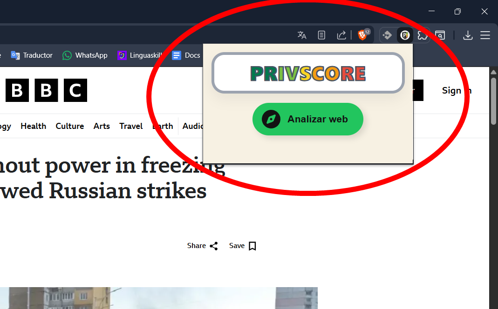
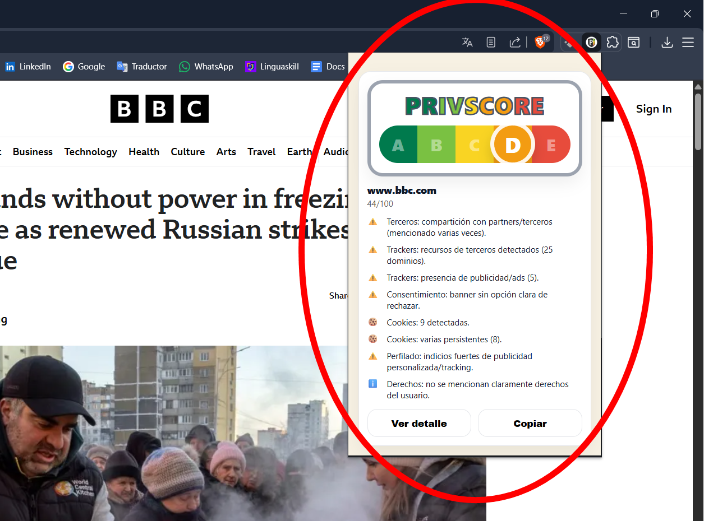
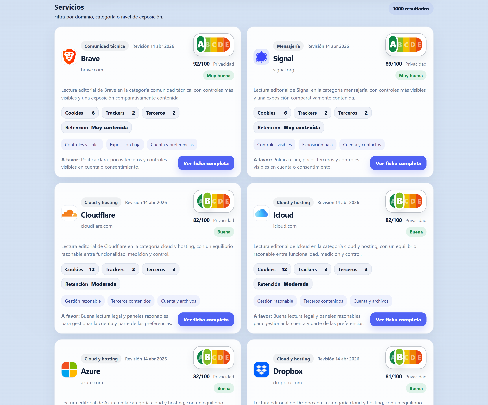
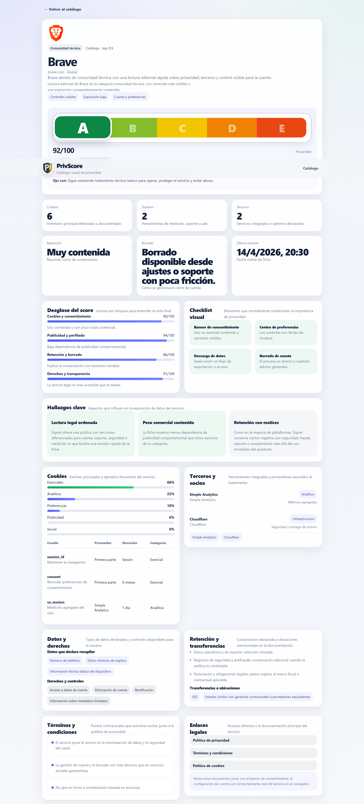

# PrivScore

> **Catálogo visual de privacidad + extensión de navegador** para analizar cualquier web y abrir su ficha detallada con una lectura A–E al estilo Nutri-Score.

[](https://github.com/marichu-kt/PrivScore)
[](https://marichu-kt.github.io/PrivScore/)
[](#instalación-de-la-extensión)


## Demo

- **Repositorio:** https://github.com/marichu-kt/PrivScore
- **Web publicada:** https://marichu-kt.github.io/PrivScore/

## Qué es PrivScore

PrivScore une dos piezas en una sola experiencia:

- un **frontend** con un catálogo visual de servicios y fichas editoriales
- una **extensión** que analiza la web abierta en el navegador

Cuando analizas una web desde la extensión y pulsas **Ver detalle**, se abre directamente una ficha dentro del frontend con:

- score **0–100**
- lectura **A–E**
- cookies y tecnologías similares
- terceros y trackers
- señales de consentimiento o CMP
- almacenamiento local detectado
- enlaces legales y política de privacidad, si existen
- resumen claro y reutilizable en la interfaz web

Si el dominio ya existe en el catálogo, la ficha dinámica reutiliza su base editorial. Si no existe, el frontend genera una ficha nueva con el mismo lenguaje visual.

---

## Capturas

### Extensión




### Frontend publicado





---

## Qué incluye el proyecto

### Frontend

- catálogo visual de servicios
- fichas completas con lectura A–E
- detalle dinámico para análisis abiertos desde la extensión
- navegación compatible con **GitHub Pages**
- rutas con `HashRouter` para evitar errores al refrescar

### Extensión

- análisis de la pestaña actual
- lectura de cookies y señales de tracking
- detección de recursos externos y dominios terceros
- búsqueda de política de privacidad y otros enlaces legales
- apertura directa del detalle en el frontend

### Backend

El backend está incluido como apoyo y base de evolución, pero el flujo principal **extensión → frontend** funciona sin depender obligatoriamente de él.

---

## Estructura del proyecto

```text
PrivScore/
├─ .github/
│  └─ workflows/
├─ backend/
│  ├─ src/
│  │  ├─ config/
│  │  ├─ controllers/
│  │  ├─ data/
│  │  ├─ lib/
│  │  ├─ middleware/
│  │  ├─ models/
│  │  ├─ routes/
│  │  ├─ app.js
│  │  └─ server.js
│  ├─ .env.example
│  └─ package.json
├─ extension/
│  ├─ icons/
│  ├─ src/
│  │  ├─ background/
│  │  ├─ content/
│  │  ├─ detail/
│  │  ├─ options/
│  │  ├─ popup/
│  │  └─ shared/
│  └─ manifest.json
├─ frontend/
│  ├─ src/
│  │  ├─ api/
│  │  ├─ app/
│  │  ├─ assets/
│  │  ├─ components/
│  │  ├─ data/
│  │  ├─ layout/
│  │  ├─ lib/
│  │  ├─ pages/
│  │  └─ styles/
│  ├─ dist/
│  ├─ index.html
│  ├─ vite.config.js
│  └─ package.json
├─ images/
│  ├─ banner.png
│  ├─ cap-1.png
│  ├─ cap-2.png
│  ├─ website.png
│  ├─ services.png
│  └─ detail_page_brave.png
├─ LICENSE
├─ PrivScore_Estructura_Codigo.md
└─ README.md
```

---

## Cómo ejecutarlo en local

### 1. Frontend

```bash
cd frontend
npm install
npm run dev
```

Abre la URL local que te muestre Vite, normalmente:

```text
http://localhost:5173/
```

### 2. Extensión

1. Abre `chrome://extensions/` o `edge://extensions/`
2. Activa **Modo desarrollador**
3. Pulsa **Cargar descomprimida**
4. Selecciona la carpeta `extension`

### 3. Configurar la URL base del frontend en la extensión

En las opciones de la extensión, usa esta URL para desarrollo:

```text
http://localhost:5173/
```

### 4. Probar el flujo completo

1. Abre cualquier web pública
2. Pulsa la extensión
3. Pulsa **Analizar web**
4. Espera a que aparezca el resultado
5. Pulsa **Ver detalle en la web**
6. Se abrirá el frontend con la ficha dinámica del análisis

---

## Publicación en GitHub Pages

El frontend está preparado para GitHub Pages con:

- `HashRouter`
- assets relativos
- flujo de despliegue desde `.github/workflows/`

### Publicar

```bash
cd frontend
npm install
npm run build
```

Después publica el contenido de `frontend/dist` o usa GitHub Actions desde el propio repositorio.

### URL base de producción para la extensión

Cuando la web ya esté publicada, en las opciones de la extensión usa:

```text
https://marichu-kt.github.io/PrivScore/
```

Así, al pulsar **Ver detalle en la web**, la extensión abrirá la ficha dinámica directamente en la web pública.

---

## Flujo de integración

1. La extensión analiza la página actual.
2. Genera un informe estructurado.
3. Ese informe se empaqueta para abrir el frontend.
4. El frontend interpreta el informe y lo renderiza como una ficha completa.
5. Desde esa ficha puedes volver al catálogo general.

---

## Qué evalúa PrivScore

La lectura final se apoya en señales como:

- volumen y perfil de cookies
- persistencia de almacenamiento
- terceros detectados
- recursos externos y trackers
- presencia de controles visibles
- claridad sobre borrado, acceso o preferencias
- información legal enlazada o detectada

La letra final se muestra en formato **A–E** para facilitar una lectura rápida y visual.

---

## Estado del proyecto

PrivScore ya permite:

- navegar un catálogo visual amplio
- abrir fichas completas desde el frontend
- analizar webs reales desde la extensión
- llevar ese análisis al frontend con el mismo estilo visual
- publicar la capa web en GitHub Pages

---

## Créditos

- Idea original: **@hugo-guarido-dominguez**
- Desarrollo: **@marichu-kt**

---

## Licencia

Este proyecto se distribuye bajo licencia **MIT**.
